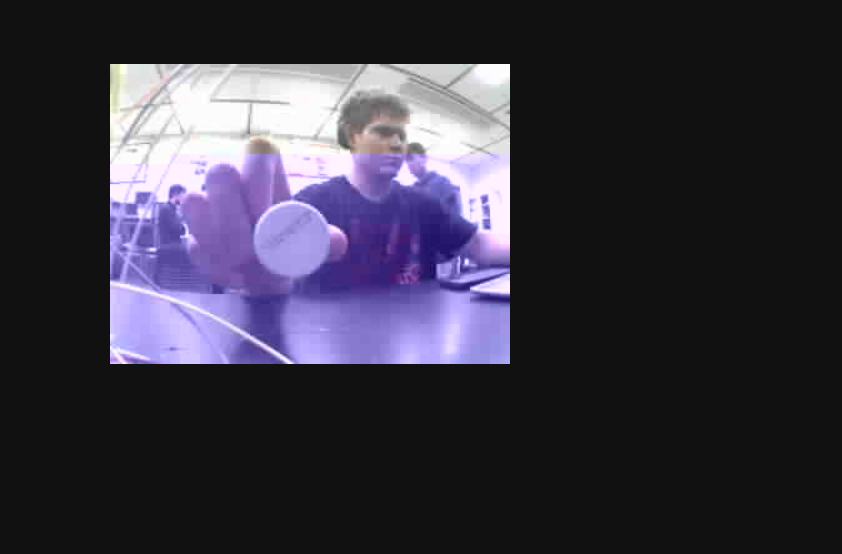
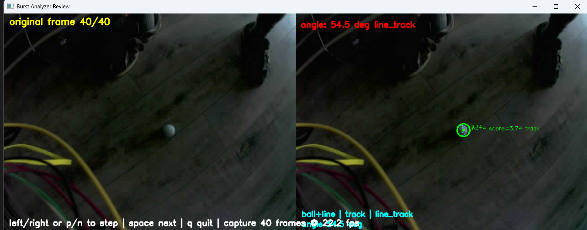
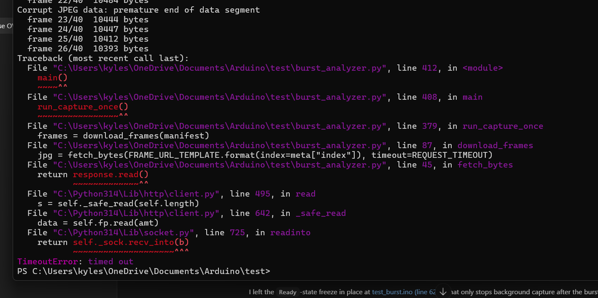
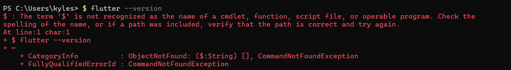
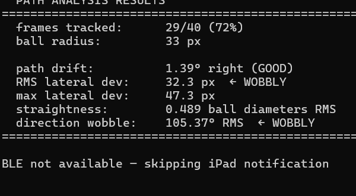

# Kyle Smith Lab Notebook
## ECE 445 Senior Design - Sensor Integrated Putter (Project 74)

**Author:** Kyle Smith  
**Course:** ECE 445, Spring 2026  
**Notebook type:** Digital Markdown lab notebook  
**Primary technical areas:** camera subsystem, ball-motion analysis, esp32S3 firmware, frontend integration, and system debugging

---

## Project Summary

The project goal is a sensor integrated smart putter that measures both putter motion and ball behavior. My main technical work centered on the camera subsystem and the software around it:

- selecting and validating the OV5640 based camera approach
- bringing up the esp32S3 camera hardware on a breadboarded prototype
- building burst capture firmware on the ESP32S3
- designing and revising the Python ballanalysis code
- integrating camera controls and analysis results into a desktop frontend
- debugging system-level issues involving WiFi, BLE, PSRAM, lighting stability, and host/app architecture

I also contributed to proposal and design documentation, subsystem requirements, verification planning, demo preparation, and integration planning between firmware, analysis code, and the app.

---

## Main Ideas Carried Forward from the Proposal

- Use an **esp32S3** because it supports camera input, PSRAM, WiFi, and BLE.
- Use an **OV5640 camera** to capture early ball motion after impact.
- Use an **IMU + piezo** to characterize putter motion and create a trigger event.
- Present processed results in an app or frontend rather than only in serial logs.
- Focus on actionable ball metrics such as:
  - average velocity
  - maximum velocity
  - path drift
  - lateral deviation
  - wobble / off-axis behavior

---

## References and Source Material

1. OpenCV documentation for `HoughCircles`, `HoughLinesP`, `fitLine`, and Lucas-Kanade optical flow.
2. PyImageSearch ball-tracking tutorials for contour-based and HSV-based detection structure.
3. GitHub repositories reviewed during algorithm design:
   - `ronheywood/opencv`
   - `aryanjagushte/Ball-Tracking-using-OpenCV-and-esp32CAM`
4. Adafruit OV5640 and esp32S3 hardware documentation.
5. ECE 445 proposal/design materials produced by the team.
6. Internal project records used to reconstruct later integration work:
   - [PROJECT_HISTORY.md](C:/Users/kyles/OneDrive/Documents/Arduino/test/PROJECT_HISTORY.md)
   - [ANALYSIS_CHANGES.md](C:/Users/kyles/OneDrive/Documents/Arduino/test/ANALYSIS_CHANGES.md)
   - [NATHAN_SETUP.md](C:/Users/kyles/OneDrive/Documents/Arduino/test/NATHAN_SETUP.md)
   - [NATHAN_ANALYSIS_UPDATE.md](C:/Users/kyles/OneDrive/Documents/Arduino/test/NATHAN_ANALYSIS_UPDATE.md)
   - [CAMERA_CODE_DESIGN_VERIFICATION.md](C:/Users/kyles/OneDrive/Documents/Arduino/test/CAMERA_CODE_DESIGN_VERIFICATION.md)

---

## Figure 1 - Camera Subsystem Architecture

---

## Key Equations Used

**Eq. 1 - Measured burst frame rate**

\[
\mathrm{fps} = \frac{N - 1}{(t_{last} - t_{first}) / 1000}
\]

where `N` is the number of captured frames and timestamps are recorded in firmware using `millis()`.

**Eq. 2 - Best-fit path drift angle**

\[
\theta_{drift} = \mathrm{atan2}(v_x, v_y)
\]

where `(v_x, v_y)` is the direction vector returned by `cv2.fitLine`.

**Eq. 3 - RMS lateral deviation**

\[
\mathrm{RMS}_{lat} = \sqrt{\frac{1}{N}\sum_{i=1}^{N} d_i^2}
\]

where `d_i` is the perpendicular distance from each tracked ball center to the best-fit path.

**Eq. 4 - Direction wobble**

\[
\theta_{wobble} = \sqrt{\frac{1}{N}\sum_{i=1}^{N} (\theta_i - \theta_{drift})^2}
\]

where `\theta_i` is the angle of each meaningful frame to frame displacement.

---

## Dated Entries

### 2026-02-09
**Course milestone:** Proposal due.

**Objective:** Finalize the project concept and define the camera related part of the proposal.

**Record**
- Worked with Nathan Hwang and Mithesh Ballae to settle on the smart putter concept.
- Helped define the smart putter subsystem boundaries and what the camera needed to measure.
- Co-authored the proposal and wrote down the initial camera related performance goals.

**Results / decisions**
- Established early that the ball behavior subsystem needed direct observation of the golf ball after impact, not only club side sensing.

---

### 2026-02-17
**Objective:** Start ordering the non PCB project parts and continue code side research while hardware was still unavailable.

**Record**
- Team parts order placed on 2/17.
- Since no physical parts had arrived yet, my work remained focused on code research, algorithm structure, and subsystem planning.
- Continued reading OpenCV references and reviewing open source ball tracking examples.

**Results / decisions**
- Confirmed that the early project period would be software/research heavy until parts arrived.

---

### 2026-02-20
**Objective:** Narrow the first pass camera and analysis approach while still waiting on hardware.

**Record**
- Compared seam/equator tracking against logo/dimple tracking and center tracking.
- Chose seam/equator tracking as the first method because it mapped most directly to roll and rotation.
- Noted that seam based detection would probably be sensitive to lighting and visible markings on the ball.

**Results / decisions**
- Had a workable first pass algorithm direction for the design document.

---

### 2026-02-23
**Course milestone:** Design document due.

**Objective:** Finish the design document with enough technical detail to support later implementation.

**Record**
- authored the design document w mithesh.
- Wrote down the OV5640 + esp32S3 hardware direction and the initial camera side software approach.
- Used the research done while waiting for parts to justify the early analysis method.

**Results / decisions**
- Locked in OV5640 + esp32S3 as the camera direction.

---

### 2026-02-27
**Objective:** Prepare the camera subsystem explanation for design review.

**Record**
- Reorganized the camera logic into a cleaner step-by-step explanation.
- Wrote down what had to happen per frame and what had to happen across frames for roll analysis.

**Results / decisions**
- Produced a more defensible design-review narrative for the camera subsystem.

---

### 2026-03-02
**Course milestone:** Design review week.

**Objective:** Present the camera subsystem as a real engineering plan rather than just an idea.

**Record**
- Used the prior research and algorithm description to support the design review.
- Explained the intended data flow from image capture to analysis output.

**Results / decisions**
- Camera work had a coherent technical basis going into implementation.

---

### 2026-03-09
**Course milestone:** Breadboard demo period.

**Objective:** Record what actually happened during the breadboard demo period and avoid overstating camera progress.

**Record**
- The breadboard demo at this point was Nathan's IMU work on a different MCU, not my camera breadboarding.
- I still had no camera parts in hand, so my work remained focused on backend algorithms, software structure, and planning.
- Used the time to continue thinking through how the analysis would eventually consume captured frames.

**Results / decisions**
- Important correction to the project record: there was no meaningful camera breadboarding yet because parts had still not arrived.

---

### 2026-03-23
**Objective:** Record the PCB ordering milestone and the fact that camera hardware work still had not started.

**Record**
- PCB related order placed on 3/23.
- Hardware still had not arrived, so I remained in the research/software phase.
- Continued documenting the analysis side assumptions and reviewing what would need to be validated once the camera could actually be powered.

**Results / decisions**
- Up through this point, my camera work was still almost entirely code side and design side.

---

### 2026-03-30
**Course milestone:** Individual progress report period.

**Objective:** Start actual camera hardware work now that physical parts were finally available.

**Record**
- First actual project parts arrived on 3/30.
- Shifted from mostly research to actual breadboarded camera development.
- Began preparing the OV5640 breakout and esp32S3 DevKitC-1 for bring-up.

**Results / decisions**
- This date marks the real start of hands on camera prototyping.

---

### 2026-04-01
**Objective:** Start breadboarding the camera system and verify the physical wiring path.

**Record**
- Soldered header pins onto the Adafruit OV5640 breakout.
- Wired the camera to the esp32S3 DevKitC-1 on the breadboard.
- Started writing and uploading camera initialization sketches.

**Results / decisions**
- Completed the first serious hardware setup for the camera subsystem.

---

### 2026-04-03
**Objective:** Verify that the breadboarded camera could produce usable output.

**Record**
- Confirmed JPEG capture at QVGA/VGA class settings.
- Started using WiFi based image serving to inspect the output more directly.
- Began shaping that work into `test.ino`, which became the live camera sketch I used before burst capture existed.

**Testing / debugging**
- Observed unstable color and frame quality behavior under some settings.

**Results / decisions**
- Confirmed that the camera basically worked, but image stability and lighting behavior still needed tuning.

---

### 2026-04-05
**Objective:** Turn the first camera bring up into a repeatable live stream setup.

**Record**
- Expanded `test.ino` into a direct WiFi stream sketch so I could view live frames in the browser.
- Used that sketch to expose the camera as `OV5640-Direct` and keep testing simple while I was still focused on backend work.
- Kept the sketch lightweight so I could change camera settings quickly and immediately see the result.

**Results / decisions**
- `test.ino` became the main sketch I used before `test_burst.ino`.

---

### 2026-04-06
**Course milestone:** Progress demo week.

**Objective:** Handle non camera project hardware while continuing to separate working demo paths from blocked ones.

**Record**
- Ordered the putter head on 4/6.
- Continued comparing the breadboarded camera path against the PCB path and concluded the breadboard setup was still the lower risk demo route.

**Results / decisions**
- Preserved the breadboard camera path as the path to keep moving quickly.

---

### 2026-04-07
**Objective:** Use `test.ino` to improve the backend before adding burst storage.

**Record**
- Fed the live camera output from `test.ino` into my backend work.
- Used the live stream to keep adjusting detection parameters without also having to solve burst timing and transfer issues.
- Continued comparing my code against the open source ball tracking approaches I had studied earlier.

**Results / decisions**
- `test.ino` gave me a stable way to work on backend detection and parameter tuning before `test_burst.ino` existed.

---

### 2026-04-08
**Objective:** Check whether the fabricated PCB could realistically host the camera path.

**Record**
- Tried adapting the camera path to the PCB pinout.
- Ran I2C scans and voltage checks.
- Compared the expected camera wiring against the actual board/module combination.

**Testing / debugging**
- Verified PWDN and RST levels.
- Still observed I2C failure.

**Results / decisions**
- The PCB camera route was not a near term substitute for the breadboarded camera setup.

---

### 2026-04-09
**Objective:** Keep improving image quality in `test.ino` so the backend results would actually mean something.

**Record**
- Adjusted `test.ino` settings such as XCLK, JPEG quality, frame size assumptions, frame buffer count, and settle frame count.
- Used the live stream to judge whether lighting and color shifts were causing bad detections in the backend.

**Results / decisions**
- Learned that backend quality depended directly on camera tuning, not just Python logic.

---

### 2026-04-10
**Objective:** Decide whether to keep investing time in PCB camera integration.

**Record**
- Reviewed the failed PCB camera bring up and what would still need to be proven.
- Investigated the Seeed module, FFC connector assumptions, and board level power details.

**Results / decisions**
- Concluded that the Seeed module and PCB connector implementation were not a practical match for the remaining schedule.
- Locked in the breadboard camera as the real demo hardware path.

---

### 2026-04-11
**Objective:** Continue improving the live camera path and the backend together.

**Record**
- Kept using `test.ino` as the camera source while refining my backend code.
- Adjusted detection thresholds around brightness, saturation, and ball contrast.
- Used the live stream to improve my version of the ball tracking logic that started from the open source references.

**Results / decisions**
- The live camera sketch was doing more than bring up hardware. It was the main tool for improving the backend before burst mode existed.

---

### 2026-04-13
**Objective:** Begin machine shop coordination one week after ordering the putter.

**Record**
- Met with the machine shop to plan the putter modifications and how the physical assembly should be executed.
- Reviewed how the enclosure and camera/PCB split would affect the final demo configuration.

**Results / decisions**
- Started the 3 day machine shop sequence needed to make the physical putter plan real.

---

### 2026-04-14
**Objective:** Continue machine shop planning and execution for the putter hardware.

**Record**
- Returned to the machine shop for the second day of work.
- Continued planning and executing the machining needed for the putter assembly.

**Results / decisions**
- Physical implementation of the putter plan progressed as intended.

---

### 2026-04-15
**Objective:** Finish the machine shop sequence and continue camera output debugging.

**Record**
- Returned to the machine shop for the third consecutive day to finish the planned putter work.
- Continued testing the breadboarded camera output and dealing with light glitching.
- This period included repeated adjustment of firmware parameters and physical capacitors on the breadboard to reduce lighting instability.

**Testing / debugging**
- The image below shows the kind of purple tint / lighting glitching I was fighting during camera setup.

**Figure 2 - Early camera output showing severe color and lighting instability**

**Results / decisions**
- Camera tuning required both software changes and breadboard hardware changes; it was not just a parameter problem.

---

### 2026-04-16
**Objective:** Keep testing lighting and saturation behavior while using `test.ino` as the camera source.

**Record**
- Ran more live camera tests under different room lighting conditions.
- Kept adjusting the Python detection logic while watching how the live stream changed in real time.
- Continued using the sketch to improve the backend before I complicated things with burst storage and downloads.

**Results / decisions**
- Confirmed that `test.ino` was the right intermediate step before moving to burst capture.

---

### 2026-04-17
**Objective:** Decide what the live stream setup still could and could not tell me.

**Record**
- Reviewed what I had learned from `test.ino` about detection quality, color stability, and lighting sensitivity.
- Noted that the live stream setup was good for backend tuning, but not ideal for precise timing or frame by frame measurement.

**Results / decisions**
- This directly motivated the move toward stored burst capture with timestamps.

---

### 2026-04-18
**Objective:** Push the camera software toward something that could support actual measurement rather than only visual inspection.

**Record**
- Continued maturing the host side analysis code.
- Kept tuning detection behavior under different brightness and saturation conditions while still using `test.ino` as the live camera source.
- Reached the point where the remaining weak spot was timing and repeatability, not just whether the backend could find the ball.

**Results / decisions**
- Confirmed that lighting sensitivity was going to be one of the core practical problems for the camera subsystem.
- Also confirmed that I needed a burst capture design next so I could measure from stored frames instead of only from a live stream.

---

### 2026-04-20
**Course milestone:** Mock demo week.

**Objective:** Move from ad hoc image viewing to quantitative burst capture suitable for demo use.

**Record**
- Designed and implemented `test_burst.ino`.
- Added PSRAM-backed burst storage, a pre trigger rolling buffer, a post trigger capture window, and HTTP endpoints for trigger, status, manifest, frame download, and clear.
- Stored each frame with a firmware side timestamp.

**Results / decisions**
- `test_burst.ino` became the main camera firmware for the rest of the project.

---

### 2026-04-21
**Objective:** Verify that burst timing was trustworthy and not being distorted by host side download timing.

**Record**
- Checked burst timing using firmware timestamps instead of host side wall clock.
- Verified that pre trigger storage preserved frames immediately before the trigger event.

**Results / decisions**
- Firmware side timestamps were required for credible fps derived metrics.

---

### 2026-04-22
**Objective:** Prepare the physical demo setup around the camera and electronics packaging.

**Record**
- Ordered and planned the shaft mounted enclosure hardware for the demo configuration.
- Finalized the practical split between breadboard camera demo hardware and PCB based putter electronics.

**Results / decisions**
- The demo hardware plan became more realistic and lower-risk.

---

### 2026-04-23
**Objective:** Improve post capture review so I could actually see what the analysis was doing frame by frame.

**Record**
- Worked on the review/debug view around captured burst frames.
- Added or refined overlay logic for tracked ball position and angle reporting.

**Testing / debugging**
- The screenshot below shows the review window used to inspect tracked frames and validate what the analysis was locking onto.

**Figure 3 - Burst review window with tracked ball overlay**

**Results / decisions**
- The review tooling became much more useful for diagnosing bad detections and algorithm mistakes.

---

### 2026-04-24
**Objective:** Debug burst download reliability and the host side transfer path.

**Record**
- Hit repeated download failures while pulling burst frames for analysis.
- Investigated timeouts, incomplete reads, and corrupted JPEG segments during frame download.

**Testing / debugging**
- The screenshot below captures a representative timeout failure during burst download:

**Figure 4 - Burst download timeout and incomplete-read failure**

**Results / decisions**
- Identified the transfer path as a serious bottleneck and future redesign target.

---

### 2026-04-25
**Objective:** Build a desktop frontend experience around the camera system so capture, calibration, and review could happen from one place.

**Record**
- Integrated a dedicated **Camera Lab** flow into the original local Flutter frontend at [frontend](C:/Users/kyles/OneDrive/Documents/Arduino/test/frontend).
- Added the camera UI page:
  - [camera_lab_page.dart](C:/Users/kyles/OneDrive/Documents/Arduino/test/frontend/lib/camera/camera_lab_page.dart)
- Added the bridge layer:
  - [camera_bridge_service_base.dart](C:/Users/kyles/OneDrive/Documents/Arduino/test/frontend/lib/camera/camera_bridge_service_base.dart)
  - [camera_bridge_service_io.dart](C:/Users/kyles/OneDrive/Documents/Arduino/test/frontend/lib/camera/camera_bridge_service_io.dart)
  - [camera_bridge_models.dart](C:/Users/kyles/OneDrive/Documents/Arduino/test/frontend/lib/camera/camera_bridge_models.dart)
- Added the desktop Python bridge and repo-local runtime copies:
  - [camera_bridge.py](C:/Users/kyles/OneDrive/Documents/Arduino/test/frontend/tool/camera_bridge.py)
  - [burst_analyzer.py](C:/Users/kyles/OneDrive/Documents/Arduino/test/frontend/tool/camera_runtime/burst_analyzer.py)
  - [ball_analyzer.py](C:/Users/kyles/OneDrive/Documents/Arduino/test/frontend/tool/camera_runtime/ball_analyzer.py)

**Windows/frontend setup friction**
- I also ran into Windows side frontend setup/debugging problems while trying to get the Flutter side usable for this work.
- The screenshot below is a small example of the environment friction I hit while getting the Windows/frontend side into shape.

**Figure 5 - Windows side Flutter setup friction while building the frontend path**

#### Kyle-style frontend / Camera Lab section

This was the first frontend version that made the camera work feel like a usable product instead of a collection of scripts.

**What it did**
- Triggered capture from the UI
- Opened calibration
- Ran the Python bridge from the desktop app
- Displayed processed camera metrics
- Gave a place to inspect artifacts and review the workflow from one screen

**Why it mattered**
- It removed the "run Python manually, inspect folders manually, and interpret logs manually" workflow.
- It created a concrete operator facing interface for the camera subsystem.
- It proved that the cameraanalysis work could be embedded into a frontend without trying to move the OpenCV work onto the ESP32 or tablet.

**Architecture used**
- ESP32 served frames over WiFi
- desktop Python fetched and analyzed those frames
- Flutter desktop launched the bridge and displayed the results

**Important constraint discovered**
- This Camera Lab flow was fundamentally a desktop-hosted analysis path, not a mobile-native path.
- That later mattered when reasoning about iPad deployment and why the same behavior would not automatically transfer to tablet runtime.

**Results / decisions**
- By the end of this day I had the version of the camera frontend that I kept referring back to later.

---

### 2026-04-26
**Objective:** Refine the Camera Lab behavior and keep tuning the camera side analysis, as well as begin migration to ios flutter

**Record**
- Worked through capture, calibration, and review flow from the desktop UI.
- Tightened the interaction between Flutter desktop, the Python bridge, and the ESP32 endpoints.
- Continued adjusting detection thresholds for brightness, saturation, and general lighting behavior.
- Refined data flow so that we were able to send data through MCU after backend results were produced.

**Results / decisions**
- The camera frontend became much more usable as a real operator tool.
- We were able to send camera analysis results through bluetooth.

---

### 2026-04-27
**Objective:** Finish the last round of metric fixes and handoff preparation before the final demo.

**Record**
- Corrected the wobble computation after identifying a unit error.
- Reframed the seam based quality metric as an RMS residual from ideal linear roll progression.
- Added ROI upsampling and angle hint assisted seam detection.
- Wrote setup and handoff instructions for Nathan in [NATHAN_SETUP.md](C:/Users/kyles/OneDrive/Documents/Arduino/test/NATHAN_SETUP.md).

**Results / decisions**
- Metrics became physically meaningful.
- Handoff documentation existed in a form Nathan could use going into the final demo.

---

### 2026-04-28
**Course milestone:** Final demo.

**Objective:** Demo the completed camera work and record the final behavior shown that day.

**Record**
- Demoed the project on 4/28.
- Used the burst capture firmware, desktop analysis tools, and frontend controls together in the final demonstrated setup.
- Verified that the camera side could capture a putt, process the saved frames, and report roll quality metrics from that run.
- The final analysis view emphasized path drift, lateral deviation, and wobble rather than relying only on seam rotation.

**Testing / debugging**
- The screenshot below shows a representative final result output from the version I had ready by demo day.

**Figure 6 - Path-based analysis results after the metric rewrite**

**Results / decisions**
- For the final version, path-based roll quality metrics were more useful than the earlier seam-focused measurements.

---
