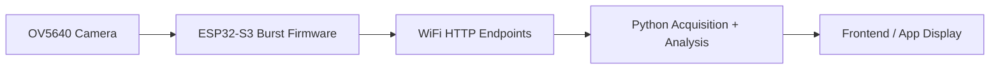

# Kyle Smith Lab Notebook
## ECE 445 Senior Design - Sensor Integrated Putter (Project 74)

**Author:** Kyle Smith  
**Course:** ECE 445, Spring 2026  
**Notebook type:** Digital Markdown lab notebook maintained in project repository  
**Project focus areas:** camera subsystem, ball-roll analysis, integration architecture, app support, and system debugging

---

## Project Summary

The project goal is a sensor-integrated smart putter that measures both putter motion and ball behavior. My primary contributions were in the camera subsystem and its analysis pipeline:

- selecting and validating the OV5640-based camera approach
- building the ESP32-S3 burst-capture firmware
- designing and revising the Python ball-analysis pipeline
- integrating the camera workflow into a desktop Flutter front end
- debugging system-level issues involving WiFi, BLE, PSRAM, and frontend/backend architecture

I also contributed to proposal/design documentation, subsystem requirements, verification planning, and integration planning between firmware, Python tooling, and app displays.

---

## Main Proposal Ideas Carried Forward

- Use an **ESP32-S3** as the embedded compute platform because it supports PSRAM, camera input, WiFi, and BLE.
- Use an **OV5640 camera** to capture the initial portion of ball motion after impact.
- Use an **IMU + piezo** to characterize putter motion and trigger the camera capture sequence.
- Use a **mobile/frontend app** to display processed results in a usable form for the golfer.
- Focus on actionable ball metrics such as:
  - average velocity
  - maximum velocity
  - path drift
  - lateral deviation
  - wobble / off-axis behavior

---

## References and Source Material

These references informed the subsystem design, algorithm structure, and implementation tradeoffs.

1. OpenCV documentation for `HoughCircles`, `HoughLinesP`, `fitLine`, and Lucas-Kanade optical flow.
2. PyImageSearch ball tracking tutorials for contour-based and HSV-based tracking structure.
3. GitHub repositories reviewed during algorithm design:
   - `ronheywood/opencv`
   - `aryanjagushte/Ball-Tracking-using-OpenCV-and-ESP32-CAM`
4. Adafruit OV5640 and ESP32-S3 hardware documentation.
5. ECE 445 proposal/design document materials produced by the team.
6. Internal project records:
   - [PROJECT_HISTORY.md](C:/Users/kyles/OneDrive/Documents/Arduino/test/PROJECT_HISTORY.md)
   - [ANALYSIS_CHANGES.md](C:/Users/kyles/OneDrive/Documents/Arduino/test/ANALYSIS_CHANGES.md)
   - [NATHAN_SETUP.md](C:/Users/kyles/OneDrive/Documents/Arduino/test/NATHAN_SETUP.md)
   - [NATHAN_ANALYSIS_UPDATE.md](C:/Users/kyles/OneDrive/Documents/Arduino/test/NATHAN_ANALYSIS_UPDATE.md)
   - [CAMERA_CODE_DESIGN_VERIFICATION.md](C:/Users/kyles/OneDrive/Documents/Arduino/test/CAMERA_CODE_DESIGN_VERIFICATION.md)

---

## Figure 1 - Camera Subsystem Architecture

---

## Key Equations Used

**Eq. 1 - Measured burst frame rate**

\[
\mathrm{fps} = \frac{N - 1}{(t_{last} - t_{first}) / 1000}
\]

where `N` is frame count and timestamps are recorded in firmware using `millis()`.

**Eq. 2 - Best-fit path drift angle**

\[
\theta_{drift} = \mathrm{atan2}(v_x, v_y)
\]

where `(v_x, v_y)` is the direction vector from `cv2.fitLine`.

**Eq. 3 - RMS lateral deviation**

\[
\mathrm{RMS}_{lat} = \sqrt{\frac{1}{N}\sum_{i=1}^{N} d_i^2}
\]

where `d_i` is the perpendicular distance of each tracked ball center from the best-fit path.

**Eq. 4 - Direction wobble**

\[
\theta_{wobble} = \sqrt{\frac{1}{N}\sum_{i=1}^{N} (\theta_i - \theta_{drift})^2}
\]

where `\theta_i` is the angle of each meaningful frame-to-frame displacement.

---

## Chronological Entries

### Entry 1 - 2026-02-09 to 2026-02-22
**Objective:** Form project direction, define subsystem responsibilities, and establish measurable goals.

**Work completed**
- Formed the team with Nathan Hwang and Mithesh Ballae.
- Participated in selecting the smart putter concept.
- Helped define subsystem boundaries and high-level system goals.
- Co-authored the proposal and contributed camera-related subsystem requirements.
- Defined ball-behavior sensing goals around frame rate, rotational sensing, and wobble detection.
- Defined mounting-related goals around weight and fit.

**Design decisions**
- Chose a camera-assisted approach rather than relying on only IMU-derived inference because ball behavior after impact is not fully observable from club sensors alone.
- Chose to treat the camera subsystem as an independent design problem with its own verification path.

**Results**
- Proposal completed.
- Requirements for the ball-behavior subsystem established early enough to drive hardware and algorithm choices.

---

### Entry 2 - 2026-02-23 to 2026-03-08
**Objective:** Convert proposal ideas into a concrete design document and evaluate camera/algorithm options.

**Work completed**
- Co-authored the design document.
- Researched ESP32-S3 + OV5640 compatibility and bandwidth limits.
- Compared candidate ball-tracking approaches:
  - seam/equator tracking
  - logo/dimple tracking
  - center tracking with geometric post-processing
- Evaluated whether a compact embedded camera system could practically meet the frame-rate target.

**Testing / analysis**
- Reviewed open-source implementations and OpenCV APIs to estimate algorithm complexity and likely robustness.
- Compared algorithm complexity against expected embedded constraints.

**Design decisions**
- Selected OV5640 for image quality and ESP32-S3 compatibility.
- Initially selected seam/equator-based rotation analysis because it appeared more directly tied to roll quality.
- Logged concern that seam-based methods might be sensitive to lighting, contrast, and ball appearance.

**Results**
- Full design document completed.
- Camera hardware and algorithm direction selected.

---

### Entry 3 - 2026-03-09 to 2026-03-22
**Objective:** Set up the embedded development environment and write down the first complete analysis plan.

**Work completed**
- Installed and configured Arduino IDE and ESP32 board support.
- Established working board settings for ESP32-S3 with OPI PSRAM and USB CDC.
- Uploaded initial test programs and verified basic board functionality.
- Wrote structured pseudocode for the ball-analysis pipeline.

**Recorded algorithm plan**
- Per-frame:
  - white/HSV masking
  - morphology
  - circle/contour validation
  - ROI extraction
  - line detection
- Multi-frame:
  - angle differencing
  - roll rate computation
  - wobble computation

**Results**
- Development environment working.
- First coherent end-to-end vision pipeline documented.

---

### Entry 4 - 2026-03-23 to 2026-04-05
**Objective:** Bring up the camera hardware and verify stable image capture on the ESP32-S3.

**Work completed**
- Soldered and wired the Adafruit OV5640 breakout to the ESP32-S3 DevKitC-1.
- Completed the full breadboard camera wiring.
- Wrote and uploaded camera initialization sketches.
- Verified JPEG frame capture at QVGA/VGA-class settings.
- Built the first WiFi streaming and image-serving firmware.

**Testing / debugging**
- Diagnosed image quality issues, especially purple tint and corruption at higher XCLK values.
- Determined the sensor required practical tuning of XCLK and startup behavior.
- Added settle-frame discard so auto-exposure and white balance could stabilize before use.

**Design decisions**
- Moved to WiFi-based desktop viewing and testing instead of trying to inspect image quality purely through serial or file dumps.
- Chose ESP32 SoftAP mode for early bench testing because it removed dependency on external network credentials.

**Results**
- Camera brought up successfully on breadboard.
- Stable JPEG serving confirmed.

---

### Entry 5 - 2026-04-06 to 2026-04-19
**Objective:** Implement the first usable computer-vision analysis tool and attempt PCB camera integration.

**Work completed**
- Built `ball_analyzer.py` as the first full analysis application.
- Added:
  - live preview
  - trigger-based capture
  - HSV calibration
  - debug playback
  - velocity / rotation / wobble calculations
- Installed Python dependencies and set up local analysis workflow.
- Tested the WiFi stream end-to-end with the analyzer.

**PCB integration attempt**
- Tried to move the camera path from breadboard to the fabricated PCB.
- Updated pin mappings for the PCB wiring.
- Ran I2C scans and power checks.
- Investigated DVDD / jumper / FFC mismatch issues.

**Testing / debugging**
- Verified PWDN and RST levels.
- Observed I2C failure and traced the issue beyond simple firmware configuration.
- Determined the Seeed camera module and PCB FFC implementation were not practically compatible for the demo schedule.

**Design decisions**
- Abandoned PCB camera integration for the demo path.
- Kept the camera subsystem on the breadboard using the Adafruit breakout.

**Results**
- Analysis script working in desktop form.
- PCB camera path documented as failed due to hardware mismatch, not left ambiguous.

---

### Entry 6 - 2026-04-20 to 2026-04-25
**Objective:** Transition from live stream viewing to burst capture with timestamped frames suitable for quantitative analysis.

**Work completed**
- Designed and implemented `test_burst.ino`.
- Added:
  - PSRAM-backed burst storage
  - pre-trigger rolling buffer
  - post-trigger capture window
  - `/trigger`, `/status`, `/manifest`, `/frame`, `/clear` endpoints
- Stored each frame with a firmware-side timestamp to avoid timing errors caused by irregular WiFi transfer.

**Testing / debugging**
- Verified capture rates using hardware timestamps rather than computer-side timing.
- Measured successful capture at roughly the required frame rate.
- Confirmed that pre-trigger frames captured the moment immediately before the trigger.

**Design decisions**
- Moved from continuous browser streaming to burst capture because analysis quality depends on deterministic frame sets and accurate timing.
- Decided that firmware-side timestamps were mandatory for any credible fps-derived metrics.

**Results**
- `test_burst.ino` became the main camera-firmware foundation.

---

### Entry 7 - 2026-04-26 to 2026-04-27
**Objective:** Build a desktop frontend for the camera pipeline and integrate the Python workflow into a usable UI.

**Work completed**
- Built a separate **Camera Lab** flow in the original local Flutter frontend at [frontend](C:/Users/kyles/OneDrive/Documents/Arduino/test/frontend).
- Added a dedicated camera page:
  - [camera_lab_page.dart](C:/Users/kyles/OneDrive/Documents/Arduino/test/frontend/lib/camera/camera_lab_page.dart)
- Added a local bridge layer:
  - [camera_bridge_service_base.dart](C:/Users/kyles/OneDrive/Documents/Arduino/test/frontend/lib/camera/camera_bridge_service_base.dart)
  - [camera_bridge_service_io.dart](C:/Users/kyles/OneDrive/Documents/Arduino/test/frontend/lib/camera/camera_bridge_service_io.dart)
  - [camera_bridge_models.dart](C:/Users/kyles/OneDrive/Documents/Arduino/test/frontend/lib/camera/camera_bridge_models.dart)
- Added the Python bridge and runtime copies:
  - [camera_bridge.py](C:/Users/kyles/OneDrive/Documents/Arduino/test/frontend/tool/camera_bridge.py)
  - [burst_analyzer.py](C:/Users/kyles/OneDrive/Documents/Arduino/test/frontend/tool/camera_runtime/burst_analyzer.py)
  - [ball_analyzer.py](C:/Users/kyles/OneDrive/Documents/Arduino/test/frontend/tool/camera_runtime/ball_analyzer.py)

#### Kyle-style frontend / Camera Lab section

This was the first version of the front end that actually made the camera subsystem feel like a product instead of a set of scripts.

**What it did**
- Triggered capture from the UI
- Opened calibration
- Ran the Python bridge from the desktop app
- Displayed processed camera metrics
- Gave a place to review artifacts and inspect the workflow from one screen

**Why it mattered**
- It removed the "run Python manually, inspect folders manually, and interpret logs manually" workflow.
- It created a concrete operator-facing interface for the camera subsystem.
- It demonstrated that the camera-analysis path could be embedded into a front end without moving the actual OpenCV workload onto the ESP32 or the tablet.

**Architecture used**
- ESP32 served frames over WiFi
- desktop Python fetched and analyzed those frames
- Flutter desktop launched the bridge and displayed the results

**Important constraint discovered**
- This Camera Lab flow was fundamentally a **desktop-hosted analysis path**, not a mobile-native path.
- That later became important when trying to reason about iPad deployment and why the same behavior did not automatically transfer to tablet runtime.

**Process note**
- A substantial amount of this integration and iteration was done with AI-assisted development tools, including Claude/Claude Code and Codex. I still validated the architecture, tested the actual workflow on hardware, and used the tools mainly to accelerate implementation and debugging rather than to replace engineering review.

**Testing / debugging**
- Verified that the desktop app could launch the Python bridge and reach the ESP32 camera endpoints.
- Confirmed that calibration and capture controls were functional on the desktop setup.
- Used this flow to surface later architectural constraints around BLE, Windows support, and iPad deployment.

**Results**
- Working desktop Camera Lab path established.

---

### Entry 8 - 2026-04-27 to 2026-04-28
**Objective:** Improve correctness of the analysis metrics and prepare the system for handoff/testing on Nathan's hardware.

**Work completed**
- Corrected the wobble computation after identifying a unit error.
- Reframed the seam-based quality metric as an RMS residual from ideal linear roll progression.
- Added ROI upsampling and angle-hint-assisted seam re-detection.
- Migrated Python-side BLE transport from `winrt` to `bless` for Mac compatibility.
- Wrote setup and handoff instructions for Nathan.

**Testing / debugging**
- Compared the previous wobble formula against the corrected unit-consistent form.
- Identified that Windows BLE peripheral support was not reliable on the target laptop.
- Confirmed Mac BLE peripheral support as the practical workaround.

**Design decisions**
- Preserved packet width while changing metric interpretation so that app-side integration stayed manageable.
- Treated transport support as a system constraint, not just a coding issue.

**Results**
- Corrected roll-quality interpretation.
- Nathan handoff path documented in [NATHAN_SETUP.md](C:/Users/kyles/OneDrive/Documents/Arduino/test/NATHAN_SETUP.md).

---

### Entry 9 - 2026-04-28
**Objective:** Replace seam-centric roll quality analysis with a more robust ball-path-based analysis.

**Work completed**
- Rewrote the core analysis approach in `ball_analyzer.py`.
- Abandoned seam/equator detection as the primary metric source.
- Switched to center tracking plus best-fit path geometry.
- Added new metrics:
  - `path_drift_deg`
  - `rms_lateral_px`
  - `direction_wobble_deg`
  - time-series lateral and forward-position data

**Testing / debugging**
- Verified that center tracking was more robust than seam visibility across different balls and lighting conditions.
- Identified that path geometry was more actionable for putter fitting than raw seam rotation rate.

**Design decisions**
- Prioritized robustness and cross-ball generality over preserving the original seam-tracking concept.
- Chose to redefine success around measurable path behavior, not around preserving an early algorithm idea.

**Results**
- Analysis became more reliable and more relevant to the intended coaching use case.

---

### Entry 10 - 2026-04-29 to 2026-05-07
**Objective:** Continue system integration, evaluate combined firmware/app architectures, and reduce bottlenecks in the camera pipeline.

**Work completed**
- Explored merged firmware paths combining camera, IMU, WiFi, and BLE.
- Identified BLE-on-Windows and dual-radio complexity as practical integration problems.
- Built and tested WiFi-only firmware variants to reduce RAM and architectural complexity.
- Explored the separation of responsibilities between:
  - camera ESP32
  - putter ESP32
  - desktop analysis host
  - tablet display app
- Developed `test_burst_2` as a hotspot-client burst variant.
- Reworked `test_burst_2` into a standalone firmware path rather than a simple wrapper.
- Added a one-shot bundled burst endpoint (`/burst.bin`) to reduce hotspot transfer overhead caused by 40 separate frame requests.

**Codex-specific work during this phase**
- Reconstructed and documented project history in [PROJECT_HISTORY.md](C:/Users/kyles/OneDrive/Documents/Arduino/test/PROJECT_HISTORY.md).
- Built alternate frontend/app paths (`frontend_redo`, `main_kyle_style.dart`, Camera Lab variants) to test architecture options.
- Debugged Windows Flutter BLE limitations and separated those from the camera workflow.
- Iterated on firmware structure for:
  - `final_firmware`
  - `final_firmware_wifi_only`
  - `test_burst_2`
- Diagnosed bottlenecks caused by network topology, per-frame HTTP latency, and mixed BLE/WiFi assumptions.

**Testing / debugging**
- Verified that PSRAM storage was generally sufficient for the configured burst sizes.
- Identified network round-trip overhead as the practical hotspot bottleneck.
- Observed that desktop-hosted Python analysis remained the most realistic path for current demo constraints.

**Design decisions**
- Treat raw frame transport, analysis, and app display as separate concerns.
- Prefer sending compact processed results to the app rather than raw frames.
- Use the notebook and history documents to preserve not only successes but also architecture dead ends and the reasons for rejecting them.

**Results**
- More coherent architecture emerged:
  - ESP32 captures and serves the burst
  - desktop host performs analysis
  - app consumes processed results

---

## Final Verification Notes

The camera subsystem verification criteria were documented formally in [CAMERA_CODE_DESIGN_VERIFICATION.md](C:/Users/kyles/OneDrive/Documents/Arduino/test/CAMERA_CODE_DESIGN_VERIFICATION.md). The most important verified outcomes were:

- burst capture at or above the required frame rate under tested conditions
- successful ball detection under normal lighting
- path-based roll metrics derived from actual tracked motion rather than assumed timing
- documented failure modes for low light, PCB camera mismatch, Windows BLE limits, and hotspot transfer latency

---

## Deliverables Produced or Co-Produced

| Deliverable | Type | Status |
|---|---|---|
| Project proposal | Document | Complete |
| Design document | Document | Complete |
| Camera subsystem algorithm pseudocode | Design | Complete |
| `test_burst.ino` burst firmware | Code | Complete, validated |
| `ball_analyzer.py` analysis pipeline | Code | Complete, revised multiple times |
| Camera Lab desktop frontend | App / Tooling | Working locally |
| Analysis change documentation | Document | Complete |
| Nathan handoff/setup docs | Document | Complete |
| Camera design verification write-up | Document | Complete |
| `PROJECT_HISTORY.md` historical reconstruction | Document | Complete |

---

## Notes for Final Submission

This notebook is intended to satisfy the digital-lab-notebook requirement by preserving:

- dated objectives
- work completed
- debugging and verification details
- design decisions and rationale
- references to code and design artifacts

If this is submitted in the course repo, I should also add any supporting figures or screenshots used in final documentation to the same `notebooks/kyle/` directory and reference them from the relevant dated entries.
